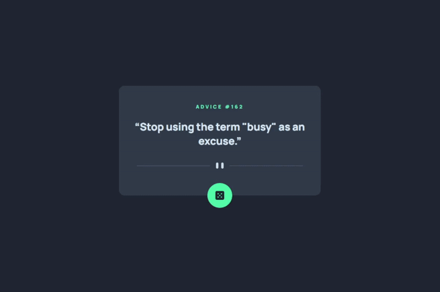

# Frontend Mentor - Advice generator app solution

This is a solution to the [Advice generator app challenge on Frontend Mentor](https://www.frontendmentor.io/solutions/advice-generator-app-using-react-sassscss-axios-and-advice-slip-api-6tLpc8UpC). Frontend Mentor challenges help you improve your coding skills by building realistic projects.

## Table of contents

- [Frontend Mentor - Advice generator app solution](#frontend-mentor---advice-generator-app-solution)
  - [Table of contents](#table-of-contents)
  - [Overview](#overview)
    - [The challenge](#the-challenge)
    - [Screenshot](#screenshot)
    - [Links](#links)
  - [My process](#my-process)
    - [Built with](#built-with)
    - [What I learned](#what-i-learned)
    - [Useful resources](#useful-resources)
  - [Author](#author)

## Overview

### The challenge

Users should be able to:

- View the optimal layout for the app depending on their device's screen size
- See hover states for all interactive elements on the page
- Generate a new piece of advice by clicking the dice icon

### Screenshot



### Links

- Solution URL: [frontendmentor.io/solutions/advice-generator-app-using-react-sassscss-axios-and-advice-slip-api-6tLpc8UpC](https://www.frontendmentor.io/solutions/advice-generator-app-using-react-sassscss-axios-and-advice-slip-api-6tLpc8UpC)
- Live Site URL: [advice-generator-app-main-six.vercel.app/](https://advice-generator-app-main-six.vercel.app/)

## My process

### Built with

- [React](https://reactjs.org/) - JS library
- SASS/SCSS
- Semantic HTML5 markup
- CSS custom properties
- Flexbox
- Desktop-first workflow

### What I learned

The bigest challenge here was to retrieve a new advice on each new click on the dice.<br>
At first `fetch` or `axios` were not getting a new advice even though I was triggering a new request to the API url.<br>
This was due to `fetch` and `axios` caching data.<br>
To overcome this issue, the solution was to add a timestamp in the URL:<br>

```js
const getData = async () => {
  const url = 'https://api.adviceslip.com/advice';

  const data = await axios.get(`${url}?timestamp=${new Date().getTime()}`);

  setAdvice(data.data.slip);
};
```

I also like this piece of CSS code to get a new image based on the screen size:<br>

```css
@media only screen and (max-width: base.$bp-small-1) {
  content: url('../../images/pattern-divider-mobile.svg');
}
```

The glow around the dice when hovering the element was also pretty fun to create.

### Useful resources

- [Pixel Perfect Pro](https://addons.mozilla.org/en-US/firefox/addon/pixel-perfect-pro/) - This helped me to display a screenshot on top of the webpage to easily check if dimensions were accurate. This is super useful is you need to create pixel perfect work.
- [PX: Viewport Dimensions](https://addons.mozilla.org/en-US/firefox/addon/px-viewport-dimensions/) - This add-on will show you the dimensions of your viewport while resizing your browser.
- [Gimp](https://www.gimp.org/) - This helped me resize screenshots provided in the project
- [Figma](https://www.figma.com) - This helped me create a rapid mockup to get dimensions of components.

## Author

🐦 Twitter: [@melwyncode](https://twitter.com/melwyncode)<br>
🧑‍💻 LinkedIn: [melwynturbant](https://www.linkedin.com/in/melwynturbant)<br>
🚀 Frontend Mentor - [@melwynt](https://www.frontendmentor.io/profile/melwynt)
